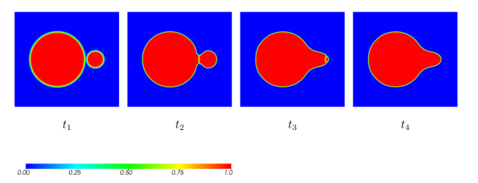

---
title: Results
date: 2019-07-12
math: true
diagram: true
---

 (Work in progress)

Transport mechanisms
--------------------

Figure \ref{adNoad} demonstrates the evolution of two particles at different time, once for the case limited to diffusion flux and on the other hand taking the advection flux in consideration as well.

<figure>
<figcaption aria-hidden="true">Figure 1: Evolution of sintering of two same sized particle at different time steps: $t_1=0, \,\,  t_2=100, \,\, t_3=500, \,\, t_4=3000$.</figcaption>
</figure>

In order to decrease the curvature a neck between the particles is formed. The neck formation is drastically accelerated, in the case rigid body motion is considered. 

In order to visualize the different diffusion paths as implemented in the phase field method, a set of simulation by only considering certain diffusion mechanisms has been performed. [Figure 2](#Fluxd) shows the diffusion Fluxes ($-\mathbf{D} \nabla \mu$) for the different conditions at the same time-step. Advection has not been considered. 

<figure>
<figcaption aria-hidden="true">Figure 2: Diffusion path of different diffusion mechanisms at $t=250$. The iso-lines represent the concentration field at $c=0.25, \, c=0.50 \,\, \text{and} \,\, c=0.75$.</figcaption>
</figure>	

It should be noticed that the arrows are colored and scaled by the magnitude of the flux and the scales are different for the different cases. 
It is notable that in the case of consideration of surface diffusion (\ref{LVS} and \ref{LVGS}) the neck is further evolved then in the other cases, since it is a predominant diffusion mechanism. Picture \ref{LV} shows the flux across the lattice end the vapor diffusion in the gas region. In fig. (\ref{LVG} adding considering the grain boundary diffusion, shows that the grain boundary diffusion only takes place in grain boundary region with a flux across the boundary. Due to the different weighing of the contribution the visibility of the mechanisms in the picture changes. The surface diffusion in \ref{LVS} leads to a flux across the surface, volume and surface diffusion are less visible, due the high values of surface diffusion flux. Fig \ref{LVGS} depict the flux considering all diffusion mechanisms. The observation reflect those made by .\cite{Hotzer2019}.

As mentioned in section the evolution of the initial stage of sintering can be analytically described by a function of the type $X\sim t^{1/m}$ where $X$ is the radius of the neck $m$ an exponent. Fig. \ref{fit} shows the well fitting of the simulated neck, calculated as $\int_{A} \eta_1 \eta_2 \,dA$ with the squared function, for the case of only diffusion fluxes. The interpolation result with an exponent of $m=5.37$.

<figure>
<figcaption aria-hidden="true">Figure 3: Neck evolution of two same sized particles [Figure 1](#ss)  and fit with a squared function. $X=0.7527(t-8.4178)^{\frac{1}{5.3765}}$.</figcaption>
</figure>	

[Figure 4](#aa) depicts the advectional flux $c v_{adv}$ considering advection as well as lattice, vapor, grain boundary and surface diffusion. 
As visible, in case of simulating two same sized particles in an along the x-axis the flux assumes constant value inside the whole particles. The advectional flux drags the particles towards each other.

<figure>
<figcaption aria-hidden="true">Figure 4: Advectional flux for sintering considering lattice, vapor, grain boundary and surface diffusion at $t=250$. The iso-lines represent the concentration field at $c=0.25, \, c=0.50 \,\, \text{and} \,\, c=0.75$$.</figcaption>
</figure>	

The compensation of the concentration lack at the grain boundary trough rigid body motion leads to a notably annealing of the particles towards each other. The difference in densification is is visible in the representation in fig. \ref{disace} , where the the evolution of the normalized distance between the grain centers is plotted. 

<figure>
<figcaption aria-hidden="true">Figure 5: Normalized distance between the grain over time.</figcaption>
</figure>	

In general rigid body motion leads to a translatorial and rotational movement of the particles. [Figure 6](#disace) represents the magnitude of the translatorial velocity in x and y direction and of the rotational velocity of a two particles system for the cases of same sized different sized particles. Note the different scaling of color bars for each figure. In the case of same sized particles only a opposite translation in x direction occurs. The velocity in y-direction and for rotation is in the range of numerical tolerance. 
On the other hand for particles having different size the velocity has an x and y component and a rotation. Due to torque maintenance the particles move in opposite direction. The smaller particle moves faster due to it's lower inertia.

<figure>
<figcaption aria-hidden="true">Figure 6: Translation and rotation velocity magnitudes for same sized and different sized particles.</figcaption>
</figure>	

Grain boundary energy anisotropy
--------------------------------
In this chapter the impact of the grain boundary energy anisotropy on the sintering kinetic will be studied. In section \ref{IN} the impact of the inclination dependency is illustrated. In section \ref{AN} the misorientation dependency is studied neglecting the impact of the plane inclination. 
  
Inclination dependency
----------------------
According to the Read-Schockley equation the degree of anisotropy can be varied by changing the value of $\delta$ between 0 and 1. In [figure 7](#RSS) simulations fro different $\delta$ values have been carried out. $\theta$ and $\theta_m$ are set to $15^{\circ}$.

<figure>
<figcaption aria-hidden="true">Figure 7: Sintering of two same sized particle with grain boundary energy anisotropy according to Read-Schockley for different degrees of anisotropy $\delta$ at time-steps: $t_1=250, \,\,  t_2=500$. The misorientation is of lattices is $\theta=15^{\circ}$</figcaption>
</figure>	

If inclination dependency is not considered $\delta=0$ a perpendicular neck is formed. On the other hand, with plane inclination dependency the neck plane reorients itself in such a way that the energy is minimized. The higher the anisotropy coefficient $\delta$ the higher the driving force for energy minimization resulting in a more accentuated inclination.   

In order to  demonstrate the functionality of the implementation of Bulatovs algorithm regarding grain boundary inclination, [figure 8](#bul)  shows simulations of sintering of two same sized particle one being attributed an Euler Angle of $0^{\circ}$ and to the other one of $25^{\circ}$. In the first case \ref{noin} the inclination of the grain boundary plane is not considered in the algorithm,  so that the plane is assumed to be always perpendicular to the [1 0 0] axis. In the second case \ref{yesin} the orientation of the grain boundary is calculated out of the gradients and the particles rotation matrices are multiplied with rotation matrix of the boundary plane to the [1 0 0] direction. The consideration of the grain boundary plane requires an evaluation of the algorithm at each quadrature point, making the simulation computationally expensive.

<figure>
<figcaption aria-hidden="true">Figure 8:Sintering of two same sized particle at $t_1=200, \,\,  t_2=1000$. Impact of grain boundary inclination dependency with Bulatov's algorithm. Euler angles of the particles: $\theta_1=0^{\circ}, \,\, \theta_2=25^{\circ}$.</figcaption>
</figure>

As visible in figure \ref{yesin} compared to \ref{noin} a slight inclination of the grain boundary plane is visible. 
In further simulation the dependency will not be considered, due to the neglectable impact in the case of rotations around the z-axis.  

Misorientation dependency
-------------------------

In this section the dependency of the sintering evolution is analyzed using Bulatov's method. The impact of the grain boundary energy variation is especially visible when analyzing different size particles. In [fig. 9] (#BulSMBG) the evolution of sintering of a big particle with an Euler angle of $0^{\circ}$ and a big small particle with euler angle of $5^{\circ}$ at different time steps is shown. 

<figure>
<figcaption aria-hidden="true">Figure 9: $t_1=0, \,\,  t_2=80, \,\, t_3=3808, \,\, t_4=3840, \,\, \theta_1=0^{\circ}, \,\, \theta_2=5^{\circ}$.</figcaption>
</figure>

[Fig. 10] (#GG) illustrate the variation in neck length and size of the smaller particle over time.

<figure>
<figcaption aria-hidden="true">Figure 10: $t_1=0, \,\,  t_2=80, \,\, t_3=3808, \,\, t_4=3840, \,\, \theta_1=0^{\circ}, \,\, \theta_2=5^{\circ}$.</figcaption>
</figure>

According to Ahmed \cite{Ahmed2013} the evolution process can be subdivided in the stages (I, II, III) as shown in the picture.
In the first stage a rapid growth of the neck is visible. After that in a second stage the neck growth seems to be stagnated, while increasing of the second particle still occurs. Finally in a third stage grain growth still takes place and the neck decreases. The competition between neck growth and grain growth can be explained trough the driving forces. 

The driving force for neck growth is the chemical potential due to the curvature of the neck (as derived in section\ref{ANA}):
\begin{equation}
\Delta \mu_{n} \sim \gamma_s (\frac{1}{r}-\frac{1}{X}) 
\label{nek}
\end{equation}
while grain growth is determined by the curvature difference between the particles:
\begin{equation}
\Delta \mu_{gg} \sim\gamma_{s} (\frac{1}{r_l}-\frac{1}{r_s})
\label{lds} 
\end{equation} 
with $r_l$ and $r_s$ being the radii of the large and small particle respectively. 

In the first stage of sintering the curvature radius $X$ is extremely small compared to the radii of the particle $r_l$ and $r_s$ so that according to eq. \ref{nek} the driving force fo  neck formation is prevalent. As neck formation goes forward the neck radius $X$ increases and grain growth as a further energy decrease mechanism takes relevance.  

The same simulation has been carried out assigning different angles to the second particle. The neck evolution over time for all analyzed cases is shown in fig. \ref{keya}, while in figure \ref{keyb} the time to complete coalescence and the grain boundary energy in dependency of the misorientation angle is plotted.

\begin{figure}[H]
	\begin{subfigure}[t]{0.5\linewidth}
		\centering
		\includegraphics[width=\linewidth]{abb/Necks.png}
		\caption{a}
		\label{keya}
	\end{subfigure}
	\begin{subfigure}[t]{0.5\linewidth}
		\centering
		\includegraphics[width=\linewidth]{abb/NecksTime.png}
		\caption{b}
		\label{keyb}
	\end{subfigure}
	\caption{hello}
	\label{key}
\end{figure}

The effect of grain boundary energy anisotropy is particularly visible in the second an third stage of sintering. An increase in grain boundary energy accelerates the time to coalescence, since the driving force for neck growth is increased.
The effect of change in grain boundary migration velocity over time can be explained with the formula derived by Kumar et al.\footnote{A migration of grain boundary energy of an increment $\Delta x$ leads to a change in volume energy and grain boundary energy:
	\begin{equation}
	\Delta E_v=\int V \, dp = (r_{gb} \theta \Delta x)\gamma_s(\frac{1}{r_s}-\frac{1}{r_l})
	\end{equation}
	and trough geometrical analysis.
	\begin{equation}
	\Delta E_{gb}= \int \gamma_{gb} \,dA= \gamma_{gb} \frac{2}{\cos(\frac{\theta}{2})[\tan(\frac{\beta}{2})-\tan(\frac{\theta}{2})] } \Delta x
	\end{equation} 
	the geometrical dimensions are referred to fig \ref{si}. The internal pressure is described using the Young-Laplace equation.  
	Following simplifications ca be adopted: $\tan(\frac{\theta}{2}) \approx 0 $,  $\cos(\frac{\theta}{2})\approx 1$ and $r_{gb}\theta\approx X$
	Inserting in an driving force approach leads to:
	\begin{equation}
	v=mF_{gb}=m[\frac{\Delta E_v-\Delta E_{gb}}{\Delta V}]=m[ \gamma_s(\frac{1}{r_s}-\frac{1}{r_l})-\gamma_{gb}\frac{2cot(\frac{\beta}{2})}{X} ]
	\end{equation}
	The change in volume is given by $\Delta V=X \Delta x$. Further details can be found in \cite{Kumar2010}.´
}
\cite{Kumar2010}.
\begin{equation}
v=m[ \gamma_s(\frac{1}{r_s}-\frac{1}{r_l})-\gamma_{gb}\frac{2cot(\frac{\beta}{2})}{X} ] \text{word or phrase}
\label{Kumar}
\end{equation}
$v$ can be interpreted as the migration velocity, $m$ a the grain boundary mobility and $\beta$ is the inclusion angle of the neck location and the center of the smaller grain (fig. \ref{si}).

\begin{figure}[H]
	\centering
	\includegraphics[width=0.6\linewidth]{abb/odo.png}
	\caption{Geometrical representation for the description of sintering of unequal particles acc. to \cite{Kumar2010}}
	\label{si}
\end{figure}
The first term of \ref{Kumar} corresponds to a driving force. The atom will move fro a region of high chemical potential (small particle) to a region of lower chemical potential (big particle). On the other hand if the migration of the grain boundary is accompanied by an increase of grain boundary area, an increase in grain boundary energy will occur, acting as a drag force to grain boundary migration represented in the second term in the equation. 
As with time the curvature at the grain boundary reduces the angle $\beta$ increases, accelerating the grain growth process. Once $\beta$ exceeds $\pi$ the cotangents will change its sign, so that the grain boundary migration velocity strongly increase, identifying the third stage in the sintering process. As the grain boundary energy increases the migration velocity also increase leading to faster grain growth. 

The above simulations did not take into account rigid body motion. As observe in section \ref{transport} rigid body motion leads to a rotation of the particle and consequently the lattice of particles will change their orientation over time,affecting grain boundary energy. Similar to the publication of Biswas et al. \cite{Biswas2018} an update of the Euler angle has been implemented. The rotation velocity of the $i$-th particle, for a rotation around a z-axis, can be determined from the torque (eq. \ref{AD_3}) as $\omega_{z,i}=\frac{m_r}{V}T_{i,z}$. The angle $\theta_i$ of each particle has to be updated for each time step: $\theta_i=\omega_{i,z}\Delta t +\theta_{old,i} $, where $\Delta t$ is the duration between two time-steps and $\theta_{old,i}$ the Euler-angle of the previous time step. 
For each time step the grain boundary energy can be recalculated using the updated angles.

In figure \ref{io} the sintering evolution of two  different sized particle for three cases is demonstrated. In all case the particles have the same initial orientation $ \theta_1=0^{\circ}, \,\, \theta_2=45^{\circ}$. While in the first case \ref{io1} rigid body motion is not considered, in the other case rigid body motion is taken into account. In the second case \ref{io2} the orientation angle of the particle is kept constant over time, while in the third case \ref{io3} the angle is update for each time-step.

In the figure is visible that for the three cases the sintering stages vary for the three cases. Furthermore the a rotation of the particles sintered particles is visible. 
	
\begin{figure}[H]
	\centering
		\begin{subfigure}[t]{0.256\linewidth}
		\centering
		\includegraphics[width=\linewidth]{abb/initdifferent.png}
		$t_0$
		\caption{Initial condition}
		\vspace{0.50 cm}
	\end{subfigure}
	\begin{subfigure}[t]{0.8\linewidth}
		\begin{subfigure}[t]{0.32\linewidth}
			\centering
			\includegraphics[width=\linewidth]{abb/updata/1.png}\\
			$t_1$
		\end{subfigure}
		%\hspace{-2.00 cm}
		\begin{subfigure}[t]{0.32\linewidth}
			\centering
			\includegraphics[width=\linewidth]{abb/updata/2.png}\\
			$t_2$
		\end{subfigure}
		\begin{subfigure}[t]{0.32\linewidth}
			\centering
			\includegraphics[width=\linewidth]{abb/updata/3.png}\\
			$t_3$
		\end{subfigure}
		\caption{Without advection.}
		\label{io1}
	\end{subfigure}\\
\vspace{0.50 cm}
	\begin{subfigure}[t]{0.8\linewidth}
		\begin{subfigure}[t]{0.32\linewidth}
			\centering
			\includegraphics[width=\linewidth]{abb/updata/4.png}\\
			$t_1$
		\end{subfigure}
		%\hspace{-2.00 cm}
		\begin{subfigure}[t]{0.32\linewidth}
			\centering
			\includegraphics[width=\linewidth]{abb/updata/5.png}\\
			$t_2$
		\end{subfigure}
		\begin{subfigure}[t]{0.32\linewidth}
			\centering
			\includegraphics[width=\linewidth]{abb/updata/6.png}\\
			$t_3$
		\end{subfigure}
			\caption{With advection.}
			\label{io2}
	\end{subfigure}\\
	\vspace{0.50 cm}
	\begin{subfigure}[t]{0.8\linewidth}
		\begin{subfigure}[t]{0.32\linewidth}
			\centering
			\includegraphics[width=\linewidth]{abb/updata/7.png}\\
			$t_1$
		\end{subfigure}
		%\hspace{-2.00 cm}
		\begin{subfigure}[t]{0.32\linewidth}
			\centering
			\includegraphics[width=\linewidth]{abb/updata/8.png}\\
			$t_2$
		\end{subfigure}
		\begin{subfigure}[t]{0.32\linewidth}
			\centering
			\includegraphics[width=\linewidth]{abb/updata/9.png}\\
			$t_3$
		\end{subfigure}
		\caption{With advection and euler angle update}
		\label{io3}
	\end{subfigure}\\
	\begin{subfigure}[t]{1.0\linewidth}
		\vspace{1 cm}
		\centering
		\captionsetup{justification=centering}
		\includegraphics[width=0.5\linewidth]{abb/Many/4.png} 
	\end{subfigure}
	\caption{Effect of advection and angle update on sintering of two different sized particle at time steps: $t_1=100, \,\,  t_2=150, \,\, t_3=200$. The initial Euler angles of the particles are set to: $ \theta_1=0^{\circ}, \,\, \theta_2=45^{\circ}$. Color-map represents $\sum_i \eta^2_i$.}
	\label{io}
\end{figure}

In figure \ref{asa} the neck length evolution for the above described simulation is plotted. Rigid body motion highly accelerates the formation of neck and grain growth, die to high densification. In case of an update of the Euler angle under this conditions grain growth takes longer than in the case where an update is neglected. The Euler angle of the particles and the corresponding grain boundary energy, for the Euler update case, are plottet in fig \ref{asa2}. The particles rotate in opposite direction, while the bigger particles rotates more slowly die to higher inertia (Note that if the Euler angle becomes negative, $360^{\circ}$ are added, causing the high angle increment for the bigger particle at the initial time steps). Due to rotation the lattices reach a configuration with low misorientation, diminishing the grain boundary energy and so that grain growth is  decelerated.

\begin{figure}[H]
	\begin{subfigure}[t]{0.5\linewidth}
		\centering
		\includegraphics[width=\linewidth]{abb/UpNeck.png}
		\caption{Neck length}
		\label{asa1}
	\end{subfigure}
	\begin{subfigure}[t]{0.5\linewidth}
		\centering
		\includegraphics[width=\linewidth]{abb/UpAn.png}
		\caption{Euler angles of particles and grain boundary energy, for the case of Euler angle update.}
		\label{asa2}
	\end{subfigure}
	\caption{Effect of advection and Euler angle update on sintering of two different sized particles.}
	\label{asa}
\end{figure}

The effect of anisotropy of the grain boundary can be applied to multiple particle system trough an interpolation of the grain boundary energy for each pair of particle over the whole domain using order parameters. 
In this work the function proposed by \cite{Moelans2008a} and integrated by \cite{Biswas2018a} for simulation of anisotropic sintering is used:
\begin{equation}
\gamma_{gb}=\frac{\sum_i \sum_j \gamma_{gb,ij}\eta^{2}_i \eta^{2}_j }{\sum_i \sum_j\eta^{2}_i \eta^{2}_j }
\end{equation}
with $\gamma_{gb,ij}$ being the grain boundary energy between the grain pair $i$ and $j$.

In fig. \ref{multi} a sintering of multiple particle is simulated. Fig. \ref{multi0} shows the evolution of grain for the isotropic case, keeping the grain boundary energy constant. In \ref{multi1} and \ref{multi2} a set of orientation is given to the grains, varying for the two configurations.

\begin{figure}[H]
	\centering
	\begin{subfigure}[t]{1.0\linewidth}
		\centering
		\includegraphics[width=0.2\linewidth]{abb/manyinit.png}\\
		$t_0$
	\caption{Initial condition}
	\end{subfigure}\\
\vspace{0.1 cm}
	\begin{subfigure}[t]{1.0\linewidth}
		\centering
		\begin{subfigure}[t]{0.20\linewidth}
			\centering
		\includegraphics[width=\linewidth]{abb/Man/1.png}\\
		$t_1$
    	\end{subfigure}
    %\hspace{-2.00 cm}
	\begin{subfigure}[t]{0.20\linewidth}
		\centering
		\includegraphics[width=\linewidth]{abb/Man/2.png}\\
		$t_2$
	\end{subfigure}
		\begin{subfigure}[t]{0.20\linewidth}
			\centering
			\includegraphics[width=\linewidth]{abb/Man/3.png}\\
			$t_3$
		\end{subfigure}
		\begin{subfigure}[t]{0.20\linewidth}
			\centering
			\includegraphics[width=\linewidth]{abb/Man/4.png}\\
			$t_4$
		\end{subfigure}
		\caption{Isotropic}
			\label{multi0}
	\end{subfigure}\\
\vspace{0.1 cm}
	\begin{subfigure}[t]{1.0\linewidth}
			\centering
		\begin{subfigure}[t]{0.20\linewidth}
			\centering
			\includegraphics[width=\linewidth]{abb/Man/5.png}\\
			$t_1$
		\end{subfigure}
		%\hspace{-2.00 cm}
		\begin{subfigure}[t]{0.20\linewidth}
			\centering
			\includegraphics[width=\linewidth]{abb/Man/6.png}\\
			$t_2$
		\end{subfigure}
		\begin{subfigure}[t]{0.20\linewidth}
			\centering
			\includegraphics[width=\linewidth]{abb/Man/7.png}\\
			$t_3$
		\end{subfigure}
		\begin{subfigure}[t]{0.20\linewidth}
			\centering
			\includegraphics[width=\linewidth]{abb/Man/8.png}\\
			$t_4$
		\end{subfigure}
		\caption{Anisotropic 1, $ 1: 9^{\circ},\,\,2: 6^{\circ},\,\,3: 36^{\circ},\,\,4: 31^{\circ},\,\,5: 16^{\circ}$}
			\label{multi1}
	\end{subfigure}\\
\vspace{0.1 cm}
\begin{subfigure}[t]{1.0\linewidth}
		\centering
	\begin{subfigure}[t]{0.20\linewidth}
		\centering		\includegraphics[width=\linewidth]{abb/Man/9.png}\\
		$t_1$
	\end{subfigure}
	%\hspace{-2.00 cm}
	\begin{subfigure}[t]{0.20\linewidth}
		\centering
		\includegraphics[width=\linewidth]{abb/Man/10.png}\\
		$t_2$
	\end{subfigure}
	\begin{subfigure}[t]{0.20\linewidth}
		\centering
		\includegraphics[width=\linewidth]{abb/Man/11.png}\\
		$t_3$
	\end{subfigure}
	\begin{subfigure}[t]{0.20\linewidth}
		\centering
		\includegraphics[width=\linewidth]{abb/Man/12.png}\\
		$t_4$
	\end{subfigure}
		\caption{Anisotropic 2, $ 1: 35^{\circ},\,\,2: 7^{\circ},\,\,3: 10^{\circ},\,\,4: 31^{\circ},\,\,5: 16^{\circ}$}
			\label{multi2}
\end{subfigure}\\
\begin{subfigure}[t]{0.5\linewidth}
	\vspace{0.5 cm}
	\centering
	\captionsetup{justification=centering}
	\includegraphics[width=\linewidth]{abb/Many/4.png}
\end{subfigure}
	\caption{Sintering of multiple particle for isotropic and two anisotropic configuration. For the isotropic case the grain boundary energy is constant at $\gamma_{gb}=0.93$. For the anisotropic configurations the angles assigned to each particles are listed under the figure description according to the numbering in the initial condition Time steps: $t_1=350, \,\,  t_2=750, \,\, t_3=1250,  \,\, t_3=1825$. Color-map represents $\sum_i \eta^2_i$. }
	\label{multi}
\end{figure}

The evolution of the particles shows the effect of grain boundary energy particularly visible in the different time steps at which grain growth occurs. Due to variation in gradient energy over the domain, the diffuse interface results to not be constant. 

The total free energy for the above mentioned cases is plotted in fig. \ref{tO}. Steps in the curve occur corresponding to the disappearance of a particle. 
\begin{figure}[H]
	\centering
	\includegraphics[width=0.6\linewidth]{abb/FreeE.png}
	\caption{Total free energy for multiple particle sintering}
	\label{tO}
\end{figure}

