\chapter{Phase-Field Model}
Phase field methods have emerged as a powerful tool to simulate the microstructure evolution on the mesoscale \cite{Chen2002}. 
One of the most important features of this model is the introduction of a diffuse interface which, in contrast to the classical models, transitions smoothly. In classical models that strictly divide structural or compositional domains using sharp interfaces, explicit tracking of the interface is required to apply physics and boundary conditions. Additionally, numerical issues may occur when interfaces merge or pinch off occurs \cite{Chen2002}. 

On the contrary, diffuse interfaces assume constant values in the bulk while values along the thin interface are continuously interpolated, to describe the transition between phases \cite{Provatas2010}.
The concept of diffuse interface was first introduced by Van der Waals in the end of the 19th century, analyzing the density variation between a liquid and vapor \cite{VanderWaals1979}. 
Decades after which Cahn \& Hilliard postulated the same concept. The basic idea is that the local free energy density is not only dependent on the field variable but also on its gradients \cite{Cahn1958}.

Phase field problems are described by a set of conserved and non-conserved variables. Conserved variables have to satisfy the continuity equation and might represent e.g., a concentration. Non-conserved variables can be use to differentiate  structures in the domain e.g., representing the orientation of different grains. 

In \ref{var} the variables for a sintering problem are exemplary depicted. The variables in this model will be normalized and dimensionless assuming values between 0 and 1. 

<figure>
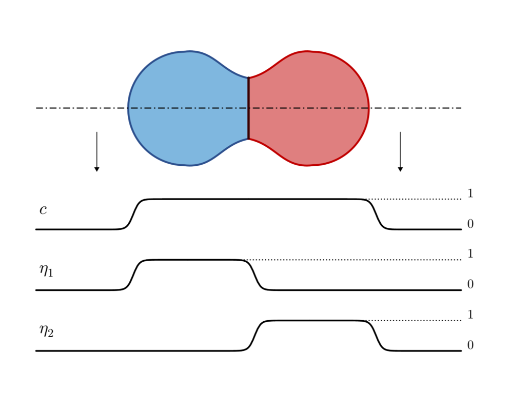<figcaption aria-hidden="true">a</figcaption>
</figure>

In the following article the mathematical description of the phase field model for sintering will be presented. First in section \ref{free energy functional} the derivation of the free energy functional according to \cite{Cahn1959} for phase field problems is illustrated. Following that the governing equations, which will describe the variable arrangement in time and space, will be proposed (section \ref{Kinetics}).
From the general phase field approach the we will look into the application on sintering problems. Therefore following the analysis of Ahmed et al. \cite{Ahmed2013} it will be demonstrated how the energy functional parameters can be uniquely correlated to the material parameters: surface energy and grain boundary energy (section \ref{inden}).
Further the calculation of the diffusional and advectional flux in this model is presented (section \ref{DIFF}). Finally the implementation of surface and grain boundary energy anisotropy for this model is introduced (sections \ref{GEA} and \ref{SEA}). 

\section{Free energy functional}\label{free energy functional}

According to the analysis of Cahn and Hilliard \cite{Cahn1959}, the free energy function of a binary solution depends on both the local composition $c$ and the adjacent composition. Consequently, the free energy can be expressed by the local contribution and the derivative of these contributions. This can be achieved by a Taylor expansion over the free energy of the solution with uniform composition $f_0(c)$. In the following derivation the subscriptions $i$ and $j$ express the replacement of the coordinates $x$, $y$ and $z$. Values for a solution with uniform composition are indicated by the subscript $0$.

The Taylor series  (here of the second order) is:
\begin{equation}
\begin{aligned}
f(c,\nabla c,\nabla^2 c, ...)= f_0(c)+\sum_i L_i (\frac{\partial c}{\partial x_i}) + \\\\
\sum_{ij} k_{ij}^{(1)}(\frac{\partial^2 c}{\partial x_i \partial x_j}) \\\\
+\frac{1}{2}\sum_{ij}k_{ij}^{(2)}[(\frac{\partial c}{\partial x_i})(\frac{\partial c}{\partial x_j})] + ...
\label{FE_1}
\end{aligned}
\end{equation}

with:

\\begin{gathered}
L\_i=\[\\frac{\\partial f}{\\partial(\\frac{\\partial c}{\\partial x\_i})} \]\_0 
\\label{FE\_2}\\\\
k\_{ij}^{(1)}=\[\\frac{\\partial f}{\\partial(\\frac{\\partial^2 c}{\\partial x\_i  \\partial x\_j})} \]\_0 
\\label{FE\_3}\\\\
k\_{ij}^{(2)}=\[\\frac{\\partial^2 f}{\\partial(\\frac{\\partial c}{\\partial x\_i} \\frac{\\partial c}{\\partial x\_j})} \]\_0
\\label{FE\_4}\\end{gathered}

\begin{gathered}
L_i=[\frac{\partial f}{\partial(\frac{\partial c}{\partial x_i})} ]_0 
\label{FE_2}\\
k_{ij}^{(1)}=[\frac{\partial f}{\partial(\frac{\partial^2 c}{\partial x_i  \partial x_j})} ]_0
\label{FE_3}\\
k_{ij}^{(2)}=[\frac{\partial^2 f}{\partial(\frac{\partial c}{\partial x_i} \frac{\partial c}{\partial x_j})} ]_0
\label{FE_4}\end{gathered}

$L_i$ is a first rank tensor, while $k_{ij}^{(1)}$ and $k_{ij}^{(2)}$ are second rank symmetric tensor.

Assuming an isotropic system, any reflection ($x_i\rightarrow -x_i $) or rotation ($x_i\rightarrow -x_j $) should not affect the free energy. Consequently 
\begin{gather}
L_i=0
\label{FE_5}\\
\begin{aligned}
k_{ij}^{(1)} = k_1 = [\frac{\partial f}{\partial \nabla^2 c}]_0  \text{\hspace{0.2cm} for \hspace{0.2cm}} i=j\\
k_{ij}^{(1)} = 0 \text{\hspace{0.2cm} for \hspace{0.2cm}} i\neq j 
\end{aligned}
\label{FE_6}\\
\begin{aligned}
k_{ij}^{(2)} = k_2 = [\frac{\partial^2 f}{(\partial \mid \nabla c \mid)^2}]_0  \text{\hspace{0.2cm} for \hspace{0.2cm}} i=j\\
k_{ij}^{(2)} = 0 \text{\hspace{0.2cm} for \hspace{0.2cm}} i\neq j 
\end{aligned}
\label{FE_7}
\end{gather}
With \ref{FE_5}, \ref{FE_6} and \ref{FE_7} the free energy functional \ref{FE_1} becomes: 
\begin{equation}
f(c,\nabla c,\nabla^2 c, ...)= f_0(c)+k_1\nabla^2 c+k_2(\nabla c)^2 + ...
\label{FE_8}
\end{equation}
The total free energy $F$ is the integration of the energy functional over the volume:
\begin{equation}
F=\int_V f dV = \int_V   [f_0(c)+k_1\nabla^2 c+k_2(\nabla c)^2 + ...] dV
\label{FE_9}
\end{equation}
Application of the product rule leads to following identity:
\begin{equation}
k_1\nabla^2c= \nabla (k_1 \nabla c )-\nabla c \nabla k_1 = \nabla (k_1 \nabla c )-\frac{dk_1}{dc}(\nabla c)^2
\end{equation}
With the above equation, the total free energy \ref{FE_9} can be rewritten as:
\begin{equation}
F=\int_V f_0(c)+ \nabla (k_1 \nabla c )-\frac{dk_1}{dc}(\nabla c)^2+ k_2(\nabla c)^2  +... dV
\end{equation}
Application of the divergence theorem $\int_V \nabla \Phi dV = \oint_S \Phi \cdot \vec{n} dS $ to the above integral
\begin{equation}
F= \oint_S k_1 \nabla c \cdot \vec{n} dS+\int_V f_0(c)  -\frac{dk_1}{dc}(\nabla c)^2+ k_2(\nabla c)^2  +... dV 
\end{equation}
With S being the boundary with the normal vector $\vec{n}$. Under the assumption that $\nabla c \vec{n}=0$ the surface integral disappears and the factors in front of $\nabla^2 c$ can be summarized as:
\begin{equation}
k= -\frac{dk_1}{dc}+k_2 = -[\frac{\partial^2 f}{\partial c \partial \nabla^2 c}]_0+[\frac{\partial^2 f}{(\partial \mid \nabla c \mid)^2}]_0
\end{equation}

Finally the total free energy reads:
\begin{equation}
F=\int_V f_0(c)+k (\nabla c)^2 dV 
\end{equation}

The here presented approach only considers a composition field $c$. In order to consider the single crystallographic orientations  $\eta_i$ Wang. et al proposed a modified energy equation which has been widely adopted in the field of modeling of sinteringand will be the base model in this thesis:
\begin{equation}
F=\int_V f_0(c,\eta_i)+\frac{k_{c}}{2} (\nabla c)^2 + \sum_i \frac{k_{\eta,i}}{2} (\nabla \eta_i)^2  dV 
\label{FE}
\end{equation}
\section{Governing squations} \label{Kinetics}

The formulation of the kinetic equations are derived according to Wang et. al. \cite{Wang2006}
The conservation law for the mass field $c$ requires:
\begin{equation}
\frac{\partial c}{\partial t}= - \nabla \cdot (c \vec{v})
\label{cons}
\end{equation}
Where the mass flux $c \vec{v} $ can be subdivided in two contribution: the diffusion flux $j_{diff}$ and the advection flux $j_{adv}$
\begin{equation}
c \vec{v}=\vec{j}_{diff} + \vec{j}_{adv} 
\label{PP5}
\end{equation}
According to Cahn-Hilliard the diffusional flux is proportional to the gradient of the chemical potential $\mu$
\begin{equation}
\vec{j}_{diff}=-\mathbf{D}\nabla\mu
\label{chem}
\end{equation}
With $\mathbf{D}$ being a diffusion coefficient, which can generally have a tensor form.
The chemical potential is considered as the variational derivative of the free energy $\mu=\frac{\delta F}{\delta c}$ leading to:
\begin{equation}
\vec{j}_{diff}=-\mathbf{D}\nabla\frac{\delta F}{\delta c}
\label{PP2}
\end{equation}
The advection flux corresponds to the mass transport trough rigid body motion. The total advection velocity is the sum of the advection velocities of the single grains $\vec{v}_{adv,i}$:
\begin{equation}
\vec{j}_{adv}=c\vec{v}_{adv} =c\sum_i \vec{v}_{adv,i} 
\label{PP4}
\end{equation}
The calculation of the advection velocity of a grain will be discussed in chapter.

Inserting  \ref{PP2} into \ref{chem} and inserting the result with \ref{PP4} into \ref{PP5} and algebraic rearrangement the  mass conservation equation \ref{cons} can so be rewritten as
\begin{equation}
\frac{dc}{dt}=\nabla \cdot (\mathbf{D} \nabla\frac{\delta F}{\delta c})- \nabla \cdot c\vec{v}_{adv,i} 
\label{res}
\end{equation}
The results is a nonlinear advection-diffusion equation. Neglecting the advection term would lead to the classical Cahn Hilliard equation (Quellen...)

With a free energy function according given by equation \ref{FE}  
\begin{equation}
\frac{\delta F}{\delta c}=\frac{\delta}{\delta c} \int_V f_0(c,\eta_i)+\frac{k_{c}}{2} (\nabla c)^2 +  \frac{k_{\eta}}{2} \sum_i (\nabla \eta_i)^2\,  dV
\label{PP}
\end{equation}
The functional derivative of generic function $E$ 
\begin{equation}
E=\int_V e(s,\nabla s) dV 
\end{equation}
can be determined, with the Euler Lagrange law as
\begin{equation}
\frac{\delta E}{\delta s}=\frac{\partial e(s,\nabla s)}{\partial s }-\nabla \cdot \frac{\partial e(s,\nabla s)}{\partial \nabla s}
\label{EULL}
\end{equation}
With the above relation \ref{PP} ($s=c$,$E=F$) can is transformed to 
\begin{equation}
\frac{\delta F}{\delta c}= \frac{\partial f_0(c,\eta_i)}{\partial c}- k_c (\nabla c)^2
\label{PP1}
\end{equation}
Inserting  \ref{PP1} into \ref{res}
\begin{equation}
\frac{dc}{dt}=\nabla\cdot [ \mathbf{D}\nabla (\frac{\partial f_0(c,\eta_i)}{\partial c}-k_c (\nabla c)^2)] - \nabla \cdot c\vec{v}_{adv} 
\end{equation}
The kinetic equation of the non-conserved variable  $\eta_i$ is represented by convectional Allen-Cahn-Equation, where the change of the order parameter is considered directly proportional to the variational derivative of the free energy ($\frac{d \eta_i}{d t}=-L_i\frac{\delta F}{\delta \eta_i}$), (Quelle) modified by the contribution of an advection term. 
\begin{equation}
\frac{d \eta_i}{d t}=-L_i\frac{\delta F}{\delta \eta_i}-\nabla \cdot \eta_i \vec{v}_{adv,i}
\end{equation}
With $L_i$ being a constant describing the mobility of grain boundary migration (Quelle Wang angeben!!!!).
Appication of the Euler-Lagrange-law to  the above equation (see \ref{EULL} with $E=F$ and $s=\eta_i$ )
\begin{equation}
\frac{d \eta_i}{d t}=-L_i(\frac{\partial f_0}{\partial \eta_i}-  k_{\eta} (\nabla \eta_i)^2)  -\nabla\cdot \eta_i \vec{v}_{adv,i}
\end{equation}

\section{Identification of model parameters}\label{inden}
\begin{equation}
f_0(c,\eta_i)= \omega c^2(1-c)^2+\xi[c^2+6(1-c)\sum_{1}^{N}\eta_1-4(2-c)\sum_{1}^{N}\eta_{i}^3+3(\sum_{1}^{N}\eta_{i}^2)^2 ]
\label{landau}
\end{equation}
\newpage
\begin{figure}[h]
	\centering
	\begin{subfigure}[t]{0.6\linewidth}
		\centering
		\includegraphics[width=\linewidth]{abb/Landau1.png}
		\caption{a}
	\end{subfigure}
	\begin{subfigure}[t]{0.6\linewidth}
		\centering
		\includegraphics[width=\linewidth]{abb/Landau2.png}
		\caption{a}
	\end{subfigure}
\end{figure}

<figure>
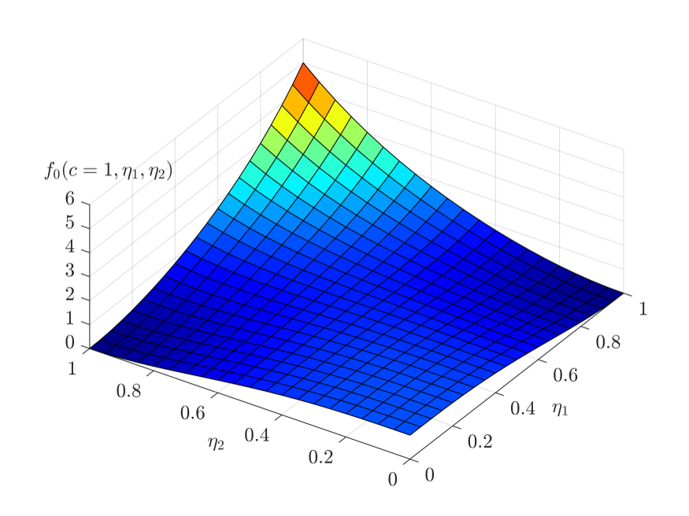<figcaption aria-hidden="true">Schematic representation of the two non-conserved variables across the interface.</figcaption>
</figure>

<figure>
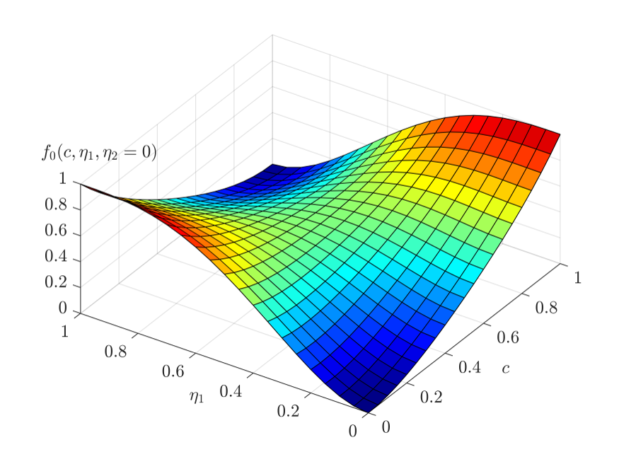<figcaption aria-hidden="true">Schematic representation of the two non-conserved variables across the interface.</figcaption>
</figure>

The parameters $\omega$, $\xi$, $ k_{\eta}$ and $k_c$ can be uniquely estimated from the grain boundary energy $\gamma_{gb}$, the surface energy $\gamma_{sf}$ and the grain boundary width $\delta$.
In the following the derivation of this relationship will be presented according to Ahmed \cite{Ahmed2013} and Chacleingam \cite{Chockalingam2016}.
This derivation is based om the equilibrium solution and the grain boundary width is assumed to be equal to the diffuse interface width.  
The energy excess corresponding to the grain boundary energy can be interpreted as the different of the energy in the domain to the bulk energy integrated over one coordinate:
\begin{equation}
\gamma_{gb}=\int_{-\infty}^{\infty}[f(c,\eta_i,\eta_j)+\frac{k_{\eta}}{2}\{ (\frac{d \eta_i}{dx})^2 +(\frac{d \eta_j}{dx})^2  \}-f(c,\eta_i,\eta_j)_{Bulk}-\frac{k_{\eta}}{2}\{ (\frac{d \eta_i}{dx})^2 +(\frac{d \eta_j}{dx})^2  \}_{Bulk}]\, dx
\end{equation}
A schematic representation of the shape of the non-conserved variables of the grain boundary is represented in picture \ref{GB_INT}

<figure>
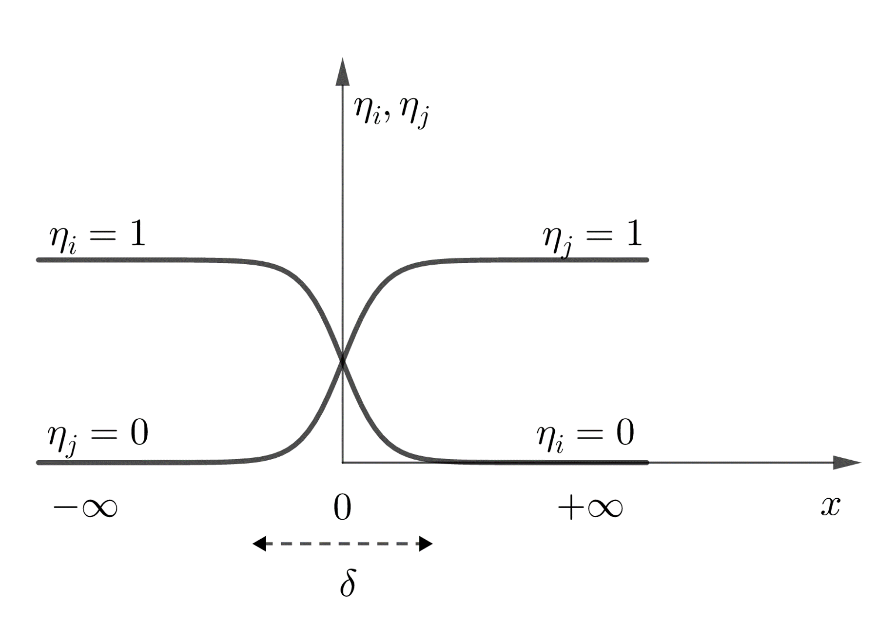<figcaption aria-hidden="true">Schematic representation of the two non-conserved variables across the interface.</figcaption>
</figure>

Since in the bulk phase gradient disappear and the free energy is the free energy functional is zero in the stable states.
In this way grain boundary energy can be expressed as:
\begin{equation}
\gamma_{gb}=\int_{-\infty}^{\infty}[f(c=1,\eta_i,\eta_j)+\frac{k_{\eta}}{2}\{ (\frac{d \eta_i}{dx})^2 +(\frac{d \eta_j}{dx})^2  \} ]\,dx
\label{GB_2} 	
\end{equation}
neglecting changes in the concentration field across the grain boundary. 
The boundary conditions of the the equilibrium shape of $ \eta_i$ and $\eta_j$ are set as following (fig \ref{GB_INT}): 
\begin{gather}
\eta_i=1 \text{\hspace{0.2 cm} and  \hspace{0.2 cm}}   \eta_j=0 \text{\hspace{0.2 cm} for  \hspace{0.2 cm}} x \rightarrow -\infty 
\label{BC_1}\\
\eta_i=0 \text{\hspace{0.2 cm} and  \hspace{0.2 cm}}   \eta_j=1 \text{\hspace{0.2 cm} for  \hspace{0.2 cm}} x \rightarrow  \infty 
\label{BC_2}\\
\frac{d\eta_i}{dx} = \frac{d\eta_j}{dx} \text{\hspace{0.2 cm} for  \hspace{0.2 cm}} x \rightarrow  \pm \infty 
\label{BC_3}
\end{gather}
In order to minimize function \ref{GB_2} Euler equation must be applied leading to:
\begin{gather}
\frac{\partial f(c=1,\eta_i,\eta_j)}{\partial \eta_i}-k_{\eta}(\frac{d^2 \eta_i}{dx^2})=0
\label{GB_5}\\
\frac{\partial f(c=1,\eta_i,\eta_j)}{\partial \eta_j}-k_{\eta}(\frac{d^2 \eta_j}{dx^2})=0
\label{GB_6}
\end{gather}
Eq. \ref{GB_5} and \ref{GB_6} can be combined to (see Appendix \ref{AppA}): 
\begin{equation}
f-\frac{k_{\eta}}{2}[(\frac{d \eta_i}{dx})^2+(\frac{d \eta_j}{dx})^2  ]=0 
\label{GB_15}
\end{equation}
Using a symmetric free energy function eq. the energy functional eq. is symmetrical with respect to the non-conserved variable $\eta_i$ and $\eta_j$ so that:
\begin{gather}
\eta_j=1-\eta_i
\label{GB_17}\\
\intertext{and consequently:}
\frac{d\eta_i}{dx}= -\frac{d\eta_j}{dx}
\label{GB_18}\\
\intertext{which can be rewritten as:}
\frac{d \eta_i}{d\eta_j}=-1 
\label{GB_19}
\end{gather}
Eq. \ref{GB_15}, with boundary conditions \ref{BC_1}-\ref{BC_3}, eq. \ref{GB_17} and eq. \ref{GB_19} can be rearranged to:
\begin{gather}
\frac{d \eta_i}{dx}=- \sqrt{\frac{f(c=1, \eta_i,\eta_j)}{k_{\eta} }}
\label{GB_20}\\
\frac{d \eta_j}{dx}= \sqrt{\frac{f(c=1, \eta_i,\eta_j)}{k_{\eta} }}
\label{GB_21}
\end{gather}
Substitution of eq.\ref{GB_15} into \ref{GB_2}:
\begin{equation}
\gamma_{gb}= \int_{-\infty}^{\infty} 2 f(c=1, \eta_i,\eta_j)\, dx
\label{GB_22} 
\end{equation}
With eq. \ref{GB_17} and $c=1$ in eq. \ref{landau}:
\begin{equation}
f(c=1,\eta_i,\eta_j=1-\eta_i)=12\xi\eta_i^2(1-\eta_i)^2
\label{GB_23}
\end{equation}
With eq. \ref{GB_23} and eq. \ref{GB_20} into eq. \ref{GB_22}:
\begin{equation}
\begin{aligned}
\gamma_{gb}=2\int_{0}^{1} f(c=1,\eta_i,\eta_j=1-\eta_i) \sqrt{\frac{k_{\eta}}{f(c=1,\eta_i,\eta_j=1-\eta_i)}}d\eta_i\\
=2 \sqrt{12k_{\eta}\xi} \int_{0}^{1} \eta_i(1-\eta_i)d\eta_i\\
=\frac{2}{\sqrt{3}} \sqrt{\xi k_{\eta}}
\end{aligned}
\label{GB_fin}
\end{equation}
The width of the diffuse interface can be approximated as:
\begin{equation}
(\frac{d \eta_j}{dx})_{x=0}= tan(\Phi)=\frac{1}{\delta}
\label{GB_25}
\end{equation}
Inserting eq. \ref{GB_23} in \ref{GB_21} with $\eta_j=0.5$ (see figure...)
\begin{equation}
(\frac{d \eta_j}{dx})_{x=0}=\sqrt{\frac{f(c=1,\eta_i=1-\eta_j,\eta_j=0.5)}{k_{\eta}}}=\sqrt{\frac{3 \xi}{4 k_{\eta}}}
\label{GB_26}
\end{equation}
Eq. \ref{GB_25} and \ref{GB_26} lead to:
\begin{equation}
\delta=\sqrt{\frac{4 k_{\eta}}{3 \xi}}
\label{GB_27}
\end{equation}
eq. \ref{GB_fin} and \ref{GB_27} provide a relationship between the model parameters $k_{\eta}$, $\xi$ and $\gamma_{gb}$,$\delta$.
In order to determine the additional parameters $ \omega$ and $k_c$ the profile of the conserved variable c and a non-conserved variable $\eta_j$ across a free surface is considered (see figure \ref{SF_INT}).

<figure>
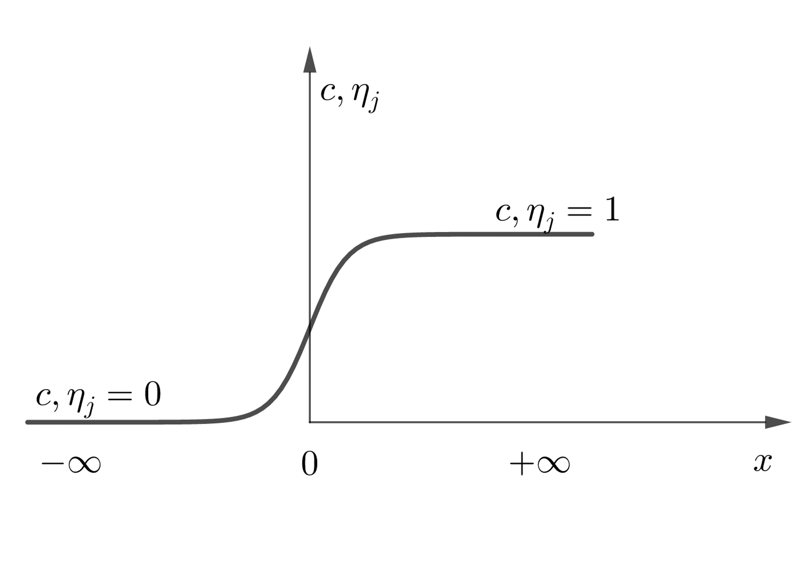<figcaption aria-hidden="true">Schematic representation of a conserved an a non-conserved variable across a free surface.</figcaption>
</figure>

Application of s similar approach as just presented for the grain boundary energy will lead to the relationships:
\begin{equation}
\frac{6\xi}{k_{\eta}}=\frac{\omega+\xi}{k_c} 
\label{cond}
\end{equation}
and
\begin{equation}
\begin{aligned}
\gamma_{sf}=\frac{\sqrt{2}}{6} \sqrt{k_c+k_{\eta}}\sqrt{\omega +7\xi}
\end{aligned}
\label{SF_fin}
\end{equation}
Recapitulating eq. \ref{GB_fin}, \ref{GB_27}, \ref{cond}, \ref{SF_fin} provide a unique relationship between between the model parameter an material parameter.
These equations can finally be rearranged as:
\begin{gather}
\omega=\frac{12\gamma_{sf}-7\gamma_{gb}}{\delta},
\label{za}\\
\xi=\frac{\gamma_{gb}}{\delta},
\label{zb}\\
k_c=\frac{3}{4}\delta(2\gamma_s-\gamma_{gb}) \text{\hspace{0.2 cm} and}
\label{zc}\\
k_{\eta}=\frac{3}{4}\delta(\gamma_{gb}).
\label{zd}
\end{gather} 

\section{Transport mechanism models } \label{DIFF}
\subsection{Diffusion}
The mobility coefficient chosen for the  many simulations of sintering process in this thesis is of functional tensorial form as widely used by many publications like \cite{Ahmed2013}, \cite{Biswas2016}, \cite{Biswas2018}.
\begin{equation}
\mathbf{D}= D_{surf} c^2(1-c)^2\mathbf{T_{surf}}+D_{gb}\sum_i \sum_j \eta_i \eta_j \mathbf{T_{gb}} +(D_{vol}\Phi(c)+ D_{vap}(1-\Phi(c)))  \mathbf{I}
\label{MOB}
\end{equation}
With $\Phi(c)=c^3(10-15c+6c^2)$.\\
$D_{surf}$, $D_{gb}$, $D_{vol}$ and $D_{vap}$ are the mobility coefficients of surface, grain boundary, volume and vapour diffusion respectively. $\mathbf{T_{surf}}$, $\mathbf{T_{gb}}$ are surface projection tensors defining the direction of surface and grain boundary diffusion respectively. $\mathbf{I}$ is the unit tensor.
The function $c^2(1-c)^2 $ limits surface diffusion to the diffuse free surface region, while $\sum_i \sum_j \eta_i \eta_j $  guarantees that grain boundary diffusion is limited to the grain boundary region. $\Phi(c)$ is a function that is $1$ in the solid region and $0$ in the void, in order to guarantee that self- and vapour diffusion occur at the expected places. 
The projection tensor $\mathbf{T_{surf}}$ tensor is determined by: 
\begin{equation}
\mathbf{T_{surf}}= \mathbf{I}-\vec{n}_{surf} \otimes \vec{n}_{surf}
\end{equation}
with $\otimes$ being the dyadic product and $\vec{n}_{surf}$ is the unit normal vector to the free interface given by:
\begin{equation}
\vec{n}_{surf}=\frac{\nabla c}{\mid \nabla c \mid}
\end{equation}
The grain boundary projection tensor is calculated as:
\begin{equation}
\mathbf{T_{gb}}= \mathbf{I}-\vec{n}_{gb} \otimes \vec{n}_{gb}
\end{equation}
with $\vec{n}_{gb} $ being the normal unit vector to the grain boundary, given as
\begin{equation}
\vec{n}_{gb}=\frac{\nabla \eta_i - \nabla \eta_i}{\mid \nabla \eta_i - \nabla \eta_i \mid} 
\end{equation}
\subsection{Advection}
In the current simulation of the advection velocity formulation proposed by Wang et al. is adopted. Rigid body motion is generated by a local force density acting on the grains. The cause of local forces lies in a lack of atom in the grain boundary, since these migrate towards the neck. Through an a rigid body motion of the particles towards each other, the concentration decay at the grain boundary can be compensated. In the approach proposed by Wang. et al. the force density is proportional to the concentration is determined by:
\begin{equation}
dF_i=k  \sum_{i\ne j}(c-c_0)\langle \eta_i \eta_j \rangle [\nabla \eta_i - \nabla \eta_j]\, dV 
\label{AD_1}
\end{equation}
where $k$ is the stiffness constant magnifying the force caused by a variation in the concentration at the grain boundary with respect to the equilibrium concentration $c_0$. The product $\eta_j \eta_j$ is used to identify the grain boundary as:
\begin{equation}
\langle \eta_i \eta_j \rangle=
\begin{cases}
0 & \text{\hspace{0.2 cm} for \hspace{0.2 cm}} \eta_i \eta_j<c_{gb} \\
1 & \text{\hspace{0.2 cm} for \hspace{0.2 cm}} \eta_i \eta_j\geq c_{gb}
\end{cases}
\label{AD_4}
\end{equation}
with $c_{gb}$ being a threshold. The gradient difference term $ \rangle [\nabla \eta_i - \nabla \eta_j]$ assures the right direction of the acting force. Consequently if the concentration at the grain boundary is lower than at equilibrium the particles will be attracted towards each other, in the opposite case they will be repulsed. In case $c=c_0$ no force fill act.
The total force acting and torque acting on a particle can be obtained respectively computing 
\begin{equation}
F_i = \int_{V} dF_i  
\label{AD_2}
\end{equation}
and
\begin{equation}
T_i=\int_{V} [r-r_{c,i}] \times dF_i  
\label{AD_3}
\end{equation}
where $r_{c,i}$ is the center of mass of the $i$th determined trough
\begin{equation}
r_i= \frac{1}{V_i} \int_{V} \eta_i r  \,dV
\label{AD_10}
\end{equation}
The volume of a particle $i$ can be obtained by the integration of $\eta_i$ over the domain
\begin{equation}
V_i= \int_{V} \eta_i\, dV
\label{AD_9}
\end{equation}
The translation and rotation velocity field can be calculated respectively as
\begin{equation}
v_{t,adv,i}= \frac{m_t}{V_i} F_i\eta_i
\label{AD_6}
\end{equation}
and
\begin{equation}
v_{r,adv,i}=\frac{m_r}{V_i} T_i \times [r-r_{c,i}]\eta_i 
\label{AD_5}
\end{equation}
where $m_t$ and $m_r$ are two constants identifying a translational and rotation mobility.
Finally the advection velocity field on a single particle is given by the addition of the contributions of translation and rotation
\begin{equation}
v_{adv,i}= v_{r,adv,i}+v_{t,adv,i}
\label{AD_8}
\end{equation}

\section{Grain boundary energy anisotropy} \label{GEA}
 Based on a dislocation model Read and Schockley \cite{T.1950} approximated the grain boundary energy of low angle tilt angles ($\theta \leq 15^{\circ} $ \cite{Kazaryan2001}) as:
 \begin{equation}
 	 \gamma_{gb}=\gamma_{gb0}(\mid \cos(\phi) \mid + \mid \sin(\phi)\mid)\Theta(1-ln(\frac{\Theta}{\Theta_m}))
 \end{equation}
 with $\gamma_{gb0}$ is a constant. $\theta$ is the misorientation angle between the to grains while $\phi$ is the inclination angle with respect to the symmetric tilt grain boundary.$\theta_m$ is the maximum misorientation. As represented in \ref{incli} the misorientation $\Theta$ can be calculated as the difference of the angles $\alpha$ and $\beta$, which are the inclination of each grain with respect to the global coordinate system. $\Phi_x$ is the inclination of the grain boundary in the global system. The inclination with respect ro the symmetry axis can be calculated as $\phi=\Phi_x-\frac{\theta}{2}$

<figure>
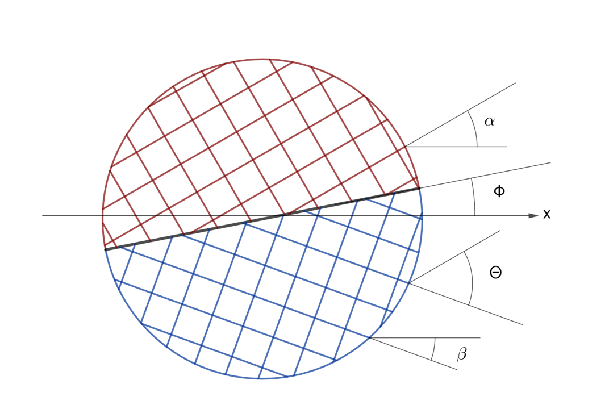<figcaption aria-hidden="true">a</figcaption>
</figure>

 In order to implement a differentiable function of the grain boundary energy with respect to inclination the form used is \cite{Kazaryan2001} \cite{Kazaryan2000} :
\begin{equation}
\gamma_{gb}=\gamma_{gb0}(1-\delta_{\gamma}\cos(4\phi))\Theta(1-ln(\frac{\Theta}{\Theta_m}))
\label{GBS}
\end{equation}
The grain boundary inclination is calculated from the grain boundary normal (in teh way proposed by \cite{Moelans2008a}) considering the symmetric boundary:
\begin{equation}
\phi=\arctan(\frac{\nabla_x\eta_i-\nabla_x \eta_j}{\nabla_y \eta_i-\nabla_y \eta_j})-\frac{\Theta}{2}
\end{equation}
Fig. \ref{easy} show the grain boundary energy according to eq. \ref{GBS}. Where $\Theta$ is the misorientation and $\phi$ the inclination with respect to the global coordinate system.

<figure>
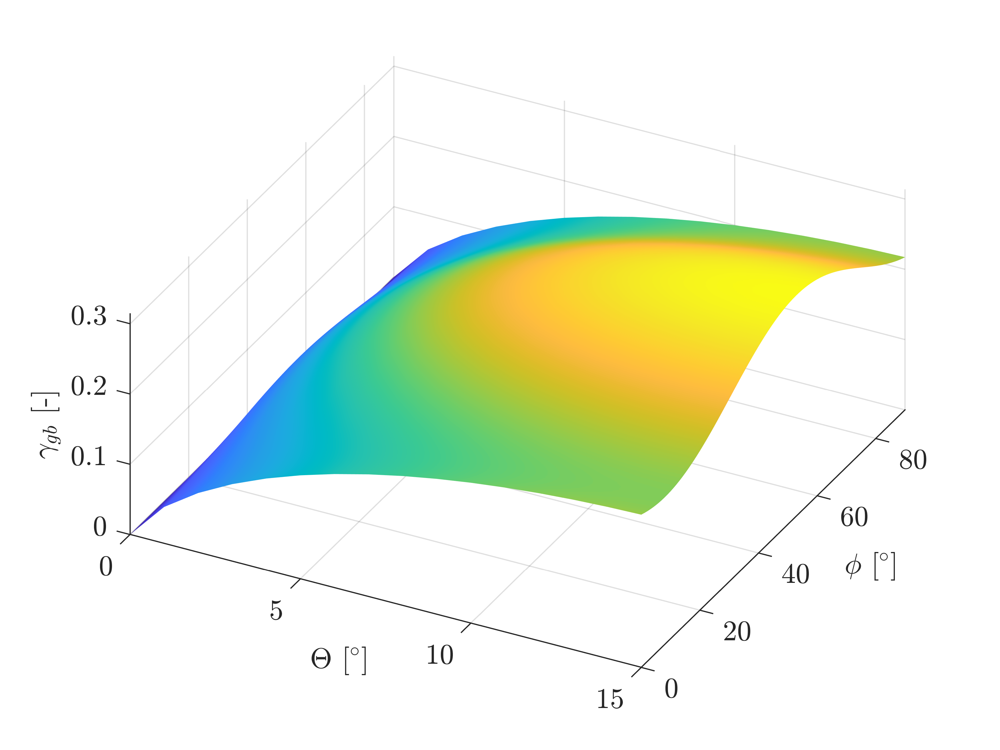<figcaption aria-hidden="true"><em>δ</em> = 0.2   <em>θ</em><em>m</em> = 15∘</figcaption>
</figure>

Butalov et al. \cite{Bulatov2014} proposed an algorithm enabling the calculation of grain boundary energy of 4 fcc metals (Cu, Ni, Al and Au) over the whole 5D space out of the orientation matrices of the grain assuming a grain boundary plane perpendicular to the [1 0 0] direction (Fig.\ref{Bula} ). 

<figure>
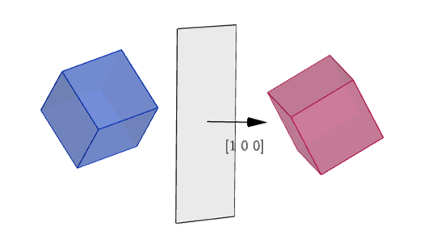<figcaption aria-hidden="true">a</figcaption>
</figure>

This algorithm is based an the interpolation method given 43 material specific fittings parameters. 
In the following the basic concept of this method presented. Detailed information are found in [].
In this method the 5D space is subdivided to a combination of lower dimensional subspaces.   
The grain misorientation is approximated by a set of rotations around the high symmetry [1 0 0], [1 1 0] and [1 1 1] axes and the geometrical distance between the exact misorientation and the approximation is determined.
Each 3D set can be subdivided in 2 and 1 dimensional subspaces. 
Pure twist boundaries and symmetric tilt boundary determine 1D subspaces since only one angle is needed to define them.
Asymmetric tilt boundaries build a 2D subspace since two angle are needed, one defining the misorientation and one the asymmetry. 
A hierarchical interpolation approach is applied to calculate the grain boundary energy.
First the energy of a pure twist or a symmetric tilt grain boundary with angle $\Theta$ can be calculated with the Read-Shockley-Wolf  \cite{Wolf1989} equation, which in Bulatov's paper is defined as:  
\begin{equation}
	\gamma_{RSW}=\sin(\frac{\pi}{2} \frac{\Theta-\Theta_{min}}{\Theta_{max}-\Theta_{min}})(1-a\ln\sin(\frac{\Theta-\Theta_{min}}{\Theta_{max}-\Theta_{min}}))
\end{equation}
with $\Theta_{max}$  and $\Theta_{min}$ being the definition limits and $a$ is a constant. The Read-Schocley-Wolf equation is a modification of the Read-Schockely equation, for high angle misorientations. 
In a second step asymmetric tilt grain boundaries are calculated as an interpolation of symmetric tilt grain boundaries.
The grain boundary energy of a 3D set is then calculated as a combination of asymmetric tilt and pure twist grain boundaries as:
\begin{equation}
\epsilon_{hkl}=\epsilon_{hkl}^{twist}(1-\frac{2\Phi}{\pi})^{p_{hkl}^1}+\epsilon_{hkl}^{tilt}(\frac{2\Phi}{\pi})^{p_{hkl}^2}
\end{equation}
for [1 0 0] and [1 1 0] directions. For [1 1 1]:
\begin{equation}
\epsilon_{111}=\epsilon_{111}^{twist}(1-\alpha\frac{2\Phi}{\pi}+(\alpha-1)(\frac{2\Phi}{\pi})^2)+\epsilon_{111}^{tilt}(1-\alpha\frac{2\Phi}{\pi}+(\alpha-1)(\frac{2\Phi}{\pi})^2)
\end{equation}
with  $p_{hkl}^1$ and $p_{hkl}^2$ and $\alpha$ being fitting parameters. The angle $\Phi$ varies between  $0$, for  twist boundaries, and $\frac{\pi}{2}$, for tilt boundaries, and all for values in between mixed boundaries are characterized. 
Finally the grain boundary energy $\epsilon$ is calculated as a combination of weighted contributions of the energy obtained by an idealized rotation of the grains around the high symmetry [1 0 0], [1 1 0] and [1 1 1] axes. 
  \begin{gather}
  \epsilon=\frac{ 1+\sum w_{hkl}\epsilon_{hkl} }{ 1+\sum w_{hkl} } \epsilon_{RGB}
  \label{a}\\
  \intertext{with  weights defined as:}
  w_{hkl}=\frac{w_{hkl}^0}{sin(\frac{ \pi d_3}{2d_{hkl}^{max}})(1-\frac{1}{2}log( sin(\frac{ \pi d_3}{2d_{hkl}^{max}}))-1}
  \end{gather}
  $d_3$ is the distance between the exact rotation of the grain and the approximated rotation. $d_{hkl}^{max}$ is the is a cutoff distance, for to high distance values. $\epsilon_{RGB}$ is a constant fitting value have a dimension. Dividing \ref{a} by $\epsilon_{RGB}$ leads to a dimensionless function with values ranging from 0 to 1.
  
  The algorithm has been provided as a MATLAB code. In this work this code has been translated to C++ to be implemented in the simulations.
  The simulations in this work will use the dimensionless grain boundary energy of copper.
  An Euler Angle has to be assigned and a rotation matrices to be assigned to the matrices have to be computed.
  Due to the fact that this method presuppose an grain boundary plane normal to the [1 0 0] the grain rotation matrices have to be multiplied with the rotation matrix of the rotation of the actual grain boundary normal vector to the [1 0 0] direction \cite{Tolliver2016}. 
  While the normal vector of the grain boundary is calculated as \cite{Moelans2008a}:
  \begin{equation}
  	\vec{n}=\frac{\nabla \eta_i -\nabla \eta_j}{\mid \nabla \eta_i -\nabla \eta_j \mid}
  \end{equation}
  Consequently Bulatov's algorithm has to be applied to each quadrature point in the domain. Since this calculation resulted in being computationally expensive, this step has not been applied and the simulations have been carried out assuming an grain boundary energy for a plane always normal to the [1 0 0].
  This neglegt can be justified by the fact that in this work this method will only be applied for 2D simulations of tilt grain boundaries around the z-Axis an analysis of the energy function shows a low dependency on grain boundary inclination. This Behavior can figure see in fig. \ref{Ana}, where grain the dimensionless energy of Cu dependent on misorientation and grain boundary inclination is depicted.   

<figure>
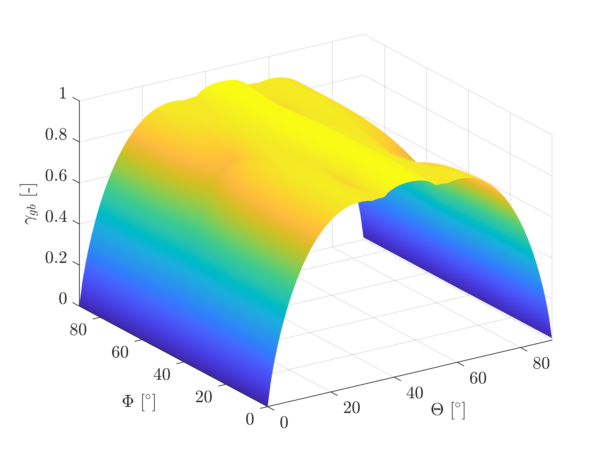<figcaption aria-hidden="true">a</figcaption>
</figure>

A study on the impact of a grain boundary inclination dependency will be carried out with eq.
In the phase field model the grain boundary energy will be implemented by replacing $\gamma_{gb}$ in  \ref{za},\ref{zb}, \ref{zc} and \ref{zd}.
In case of simulation of sintering of more than two particles an continuous function of the grain boundary over the domain has to be applied.
In this work the function proposed by \cite{Moelans2008a} and integrated by \cite{Biswas2018a} for simulation of anisotropic sintering is used:
\begin{equation}
\gamma_{gb}=\frac{\sum_i \sum_j \gamma_{gb,ij}\eta^{2}_i \eta^{2}_j }{\sum_i \sum_j\eta^{2}_i \eta^{2}_j }
\end{equation}
with $\gamma_{gb,ij}$ being the grain boundary energy between the grain pair $i$ and $j$.
  
  
  
  
  
  
  
  
%This distance is approximated as $d_3 = 2sin(\delta/2)$, where $\delta$ is the smallest residual angle  
  
%\begin{equation}
%d_3 = 2sin(\delta/2)
%\end{equation}
%\begin{equation}
%d_2=2- \vec{m}_1 \cdot \vec{n}_1 - \vec{m}_2 \cdot \vec{n}_2 
%\end{equation}

%\begin{figure}[H]
%	\centering
%	\includegraphics[width=0.4\linewidth]{abb/EnergyTwoAngle.png}
%	\caption{a}
%\end{figure}

\section{Surface energy anisotropy}  \label{SEA}
Simulation of faceting of crystals requires a description of the surface energy in dependency of the orientation of the crystals surface. The crystals facets will then be formed according to those orientations that are energetically favorable, so the direction with in which the energy has a minimum. 
%
%A simple widely used function is the fourfold symmetric model is:
%
%\begin{equation}
%\gamma_{sf}(\vec{n})=1+\alpha(\sum_{1}^{d} n^4_i -3)
%\label{tora}
%\end{equation}
%where $d$ is the number if dimension $n_i$ are the components of the surface unity normal vector and alpha is a constant describing the degree of anisotropy \cite{Torabi2009b}, \cite{Chen2018}. 
%The surface normal vector can be determined as:
%
%\begin{equation}
%	\vec{n}=\frac{\nabla c}{\mid \nabla c \mid}
%\end{equation}
%
%
%In the 2D case \ref{tora} can be also written as:
%\begin{equation}
%\gamma_{sf}(\theta)=1+\alpha\cos(4\theta)
%\end{equation}
%with $\theta$ being the angle between the normal vector and the abscissa. 

%This function is minimal when $\vec{n}$ lies in the [1 1 1] direction for the 3D case and [1 1] direction for 2D (or $\theta$ being a multiple of $\frac{\pi}{4}$).
Representation of complex crystals having various facets directions of different surface energy require an adaptable model.
A convenient formulation has been provided by Salvalaglio et al \cite{Salvalaglio2015}.
\begin{equation}
\gamma_{sf}(\vec{n})=\gamma_0(1-\sum_{1}^{N}\alpha_i(\vec{n}\cdot \vec{m_i})^{w_i}\,\theta(\vec{n}\cdot \vec{m}))
\label{SL_1}
\end{equation}
In this function $N$ is the number of energetic minima. $m_i$ are the unit vectors for which the funtion has a minimum, $\alpha_i$ and $w_i$ are coefficients defining how deep and how wide each minimum is and $\gamma_0$ is a constant factor.  In order to be differentiable $w_i\geq2$is required.
$\theta(\vec{n}\cdot \vec{m})$ is the Heaviside step function, which excludes contributions in the surface energy for the case of a negative scalar product $\vec{n}\cdot \vec{m}$
\begin{equation}
\theta(\vec{n}\cdot \vec{m_i})=
\begin{cases}
0 & \text{\hspace{0.2 cm} for \hspace{0.2 cm}} \vec{n}\cdot \vec{m}_i < 0 \\
1 & \text{\hspace{0.2 cm} for \hspace{0.2 cm}} \vec{n}\cdot \vec{m}_i\geq 0
\end{cases}
\label{SL_2}
\end{equation}

The absolute value of the scalar product $vec{n}\cdot \vec{m}$ is always less than 1 one for $\vec{n} \neq \vec{m_i}$ and is 1 for  $\vec{n} = \vec{m_i}$, so for the last case the highest contribution in the energy minimization is given. The value of $ \gamma_{sf}(\vec{n})$ continuously increases when the normal vector moves away from a favorable direction.
The course of the function an the impact of the parameters $\alpha_i$ and $w_i$ is demonstrated in the exemplary plot \ref{s2d} for the 2D dimensional case. In 2D a direction can also be represented by a single angle $\Theta$ between the normal vector and the abscissa $\Theta = -\arctan(\frac{n_x}{n_y})$.  In figure \ref{s2d} the [1 1] directions and the [1 0] directions (and all their symmetries) are considered. These direction have different $\alpha$ values which leads to different deep minima. For the dotted and dashed line all minima have the same $w_i$ values but in in the second case $w_i$ is increased. Increasing $w_i$ decrease the width of the single minima, which are more defined and decoupled from each other.
The solid line further demonstrates this behavior, for different $w_i$  for different directions.
For sufficiently high $w_i$ values the maximal grain boundary energy $\gamma_0$ is reached. 

<figure>
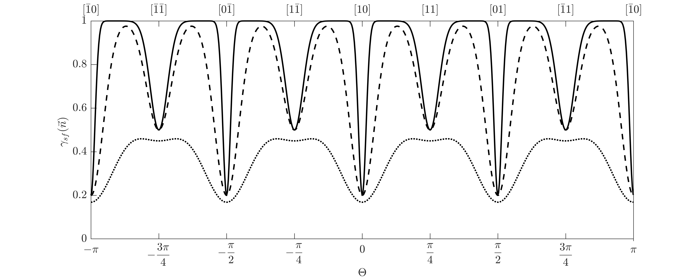<figcaption aria-hidden="true">a</figcaption>
</figure>

Fig \ref{s3d} is a 3D representation of the anisotropic surface energy over a sphere, for minima at the [1 0 0] and [1 1 1] directions (and all their symmetries) having different $\alpha$ values.

<figure>
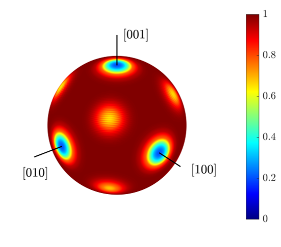<figcaption aria-hidden="true">a</figcaption>
</figure>

For the simulation of sintering of faceted particles in this work the total free energy \ref{FE} is modified.
\begin{gather}
F=\int_V f^{*}_0(c,\eta_i)+\frac{k^{*}_{c}}{2} (\nabla c)^2 + \frac{k^{*}_{\eta}}{2} \sum_i  (\nabla \eta_i)^2 + \frac{\beta}{2}(\Delta c)^2\, dV 
\label{FS} \\
\intertext{\hspace{0.2 cm} with}
f_0(c,\eta_i)= \omega^{*} c^2(1-c)^2+\xi^{*}[c^2+6(1-c)\sum_{1}^{N}\eta_1-4(2-c)\sum_{1}^{N}\eta_{i}^3+3(\sum_{1}^{N}\eta_{i}^2)^2 ]
\label{landaustern}
\end{gather}
The term $\frac{\beta}{2}(\Delta c)^2$, which function will be discussed in the end of this section, is added and the parameters $\omega\, \xi\,k_c \,k_{\eta}$ 
 (\ref{za},\ref{zb}, \ref{zc} and \ref{zd}) in front of the gradient terms and in the landau polynomial \ref{landau} are replaced by $\omega^{*},\xi^{*}\,k_{\eta}^{*}\,k_c^{*}$.  
as:
\begin{gather}
\omega^{*}=\frac{12\gamma_{0}-7\gamma_{gb}}{\delta},
\label{qa}\\
\xi^{*}=\xi=\frac{\gamma_{gb}}{\delta},
\label{qb}\\
k_c^{*}=\frac{3}{4}\delta(2\gamma_{sf}(\vec{n})-\gamma_{gb}) \text{\hspace{0.2 cm} and}
\label{qc}\\
k_{\eta}^{*}=k_{\eta}=\frac{3}{4}\delta(\gamma_{gb}).
\label{qd}
\end{gather} 

The grain surface energy in $\gamma_{sf}$ in \ref{za} $\omega$ is set to the constant $\gamma_0$ in \ref{qa} so that the variation of the surface energy does not affect the local energy function. Instead the orientation dependent term $\gamma_{sf}(\vec{n})$ is implemented in the gradient term of the concentration \ref{qc}. 

Applying a fully variational approach, the variation of the surface energy with the concentration gradient 
has to be considered. Variational calculus as reported in  \ref{Kinetics}, without considering advectional transport, lead to a kinetic equation for the concentration as:  
\begin{equation}
\frac{dc}{dt}=\nabla  \cdot (\mathbf{D} \nabla \frac{\delta F}{\delta c})= \nabla \cdot [ \mathbf{D} \nabla(\frac{\partial f^{*}_0(c,\eta_i)}{dc} - k_c^{*}\nabla^2 c -\nabla \cdot \frac{\partial k_c^{*}}{\partial \nabla c} (\nabla c)^2 -\beta\Delta(\Delta c))]
\label{anis}
\end{equation}

with the substitution 
\begin{equation}
\vec{\mathbf{g}}= k^{*}_c\nabla^2 c +\nabla \cdot \frac{\partial k^{*}_c}{\partial \nabla c} (\nabla c)^2
\label{sub}
\end{equation}
\ref{anis} can be rewritten as:
\begin{equation}
\frac{dc}{dt}=\nabla \cdot [ \mathbf{D} \nabla \frac{\delta F}{\delta c}]= \nabla \cdot [\mathbf{D} \nabla(\frac{\partial f^{*}_0(c,\eta_i)}{\partial c}  -\nabla \vec{\mathbf{g}} -\beta\Delta(\Delta c))]
\end{equation}

The term $\frac{\partial k^{*}_c}{\partial \nabla c}$ in \ref{sub} equals:
\begin{equation}
\frac{\partial k^{*}_c}{\partial \nabla c}=\frac{3}{4}\delta(2\frac { \partial \gamma_s(\vec{n})}{\partial \nabla c})
\end{equation}

The partial differentiation of the direction dependent surface energy with respect to the concentration gradient leads to:
\begin{equation}
\frac { \partial \gamma_s(\vec{n})}{\partial \nabla c}=\frac{\partial \vec{n}}{\partial \nabla c } \frac{ \partial \gamma_{sf}(\vec{n})}{\partial \vec{n}}=\frac{1}{\mid \nabla c \mid} (I- \vec{n} \otimes \vec{n}) \frac { \partial \gamma_{sf}(\vec{n})}{\partial \vec{n}}
\label{SL_3}
\end{equation}

The differentiation of the surface energy with respect to the normal vector applied to  \ref{SL_1} leads to vector, which components are:
\begin{equation}
\frac { \partial \gamma_{sf}(\vec{n})}{\partial \vec{n}_j}=-\gamma_0 \sum_{i=1}^{N }w_i \alpha_i m_{ij}(\vec{n} \cdot \vec{m}_i)^{w_i-1}\Theta(\vec{n} \cdot \vec{m}_i)
\label{SL_4}
\end{equation}

where $m_{ij}$ is the $j$th component of $\vec{m}_i$ and $n_j$ id the $j$-th component of the normal vector.

It be noted that the kinetic equation of the non-conservative parameters is not modified  other than formally replacing the coefficients with the *-coefficients. 
The advection term will not be considered in the case of surface anisotropy, die to computational costs. 

The term $\frac{\beta}{2}(\Delta c)^2$ is a regularization term. If the energy surface of certain orientation is too high they might not appear in the final equilibrium shape. As a result of missing orientations the interface might not be smooth but have discontinuties \cite{Chen2013}. This might lead to a ill-posedness of the Cahn-Hiliard equation as proven in \cite{Wise2007}. The here used laplacian regularization with the reg.- parameter $\beta$ is used to correct this problem.

